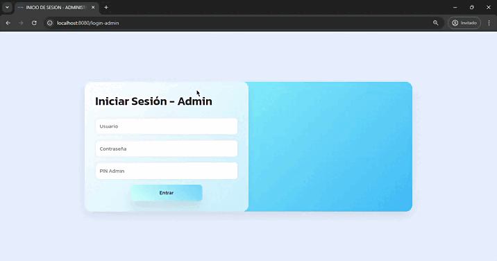

# ServiApp: Plataforma para gestionar tus Servicios Publicos

## Descripcion Rapida

**ServiApp** es una plataforma web desarrollada en Spring Boot que facilita la gestión de servicios públicos para los habitantes de Cartagena. A través de una API, ServiApp ofrece herramientas para optimizar el consumo de servicios como energía, agua y gas, además de fomentar un uso más responsable y consciente de los recursos.

 

  

## Funcionalidades

- **Gestión de Servicios Públicos**: Calcula el consumo generado en servicios públicos y permite compararlo con períodos anteriores y el consumo promedio de la ciudad.
- **Consejos de Ahorro**: Ofrece recomendaciones personalizadas de ahorro basadas en el nivel de consumo (bueno, promedio o grave) y el tipo de servicio.
- **Líneas de Atención**: Proporciona información estática sobre cómo contactar a las empresas de servicios públicos.
- **Visor de Eventos**: Informa sobre cortes de servicio programados y permite a los usuarios reportar fallas inesperadas.

**Interfaz de Usuario preview**

 

  

## Objetivos

Nuestro objetivo es mejorar la experiencia del usuario en la gestión de servicios públicos, promoviendo el cuidado del medio ambiente y la conciencia sobre el uso responsable de recursos. Este proyecto también representa una oportunidad académica para aplicar conocimientos teóricos en un entorno real y fomentar el trabajo en equipo.

## Colaboradores

- [Carlos Del rio (Mi persona)](https://github.com/cdelriot1121)
- [Willys Hurtado](https://github.com/Sirwillys06)
- [Giovanny Orozco](https://github.com/Gaos-Orozco)
- [Valeria Hernández](https://github.com/valeriahh33)

Este es un panel diseñado para los administradores, utilizando temporalmente para controlar el flujo de datos

 

  

## Tener en Cuenta
Por favor, tener en cuenta que el trabajo hasta la fecha 18-oct-2024 no esta terminado solo tenemos el maquetado de los wireframes que diseñamos con anterioridad, ya que falta desarrollar aun las funcionalidades con los recursos que nos ofrece springboot, todo esto teniendo en cuenta los conocimientos adquiridos a lo largo del semestre

## Conclusión

ServiApp se destaca por su enfoque integral, no solo facilitando la gestión de los servicios públicos, sino también educando a los usuarios sobre un consumo más responsable. Así, ofrecemos una solución completa y adaptada a las necesidades de la comunidad cartagenera.
